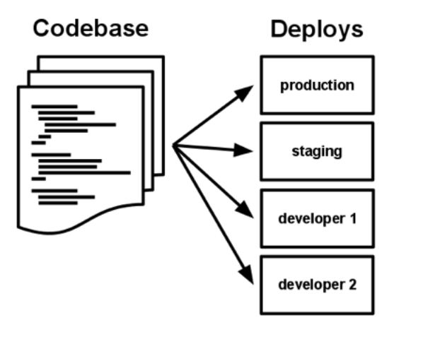

# 12factor
## Codebase
A codebase is any single repo or any set of repos who share a root commit.

There is only one codebase per app, but there will be many deploys of the app. 

## Build, release, run

