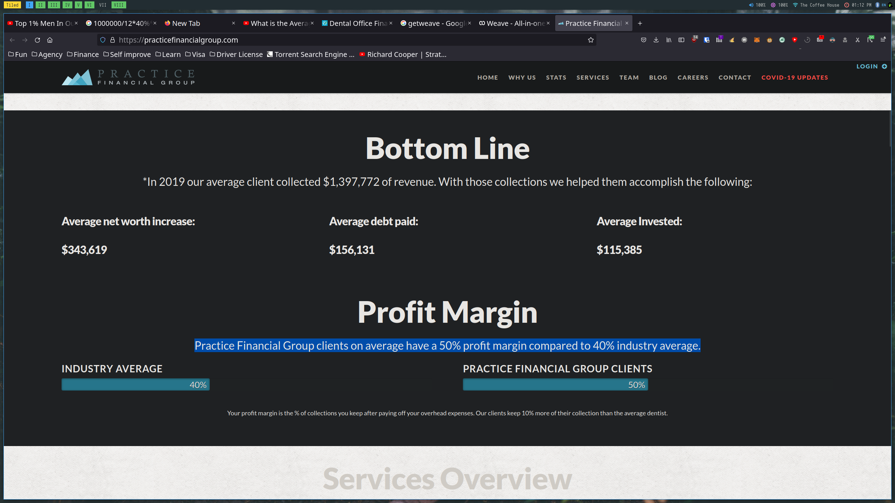

# Dentist

## Step 1: Understand The Business Model
1. Are you passionate about this niche?

Is this profession recession-proof? Not really.
Must at least have a certain level of interest.
## Step 2: Get Some Benchmarks
1. ‘How much does the average {your niche} make a year?’
Average dentist makes around 100k. 
2. ‘What’s the average profit margin of {your niche}?’
   Average is 40%. 
3. ‘How many employees does the average {your niche} have?’
Industry peak: ~30

4. ‘What sort of expenses does {your niche} have?’

they can afford to spend $2000 on ads.
## Step 3: Marketing Specific Tactics

1. ‘How to get results for {your niche} with {your service}’

2. ‘{your niche} marketing case study’

3. ‘{your niche} {your service} case study’

## Niche Research Questionnaire 

1. What is the average revenue of a client in your niche?
A simple tooth extraction can cost 150 (minimum expense for a trip). This can go up to 2500.
2. What is the average expenses of a client in your niche?

Average 500-2500

3. How many employees on average does a {your niche} have?
