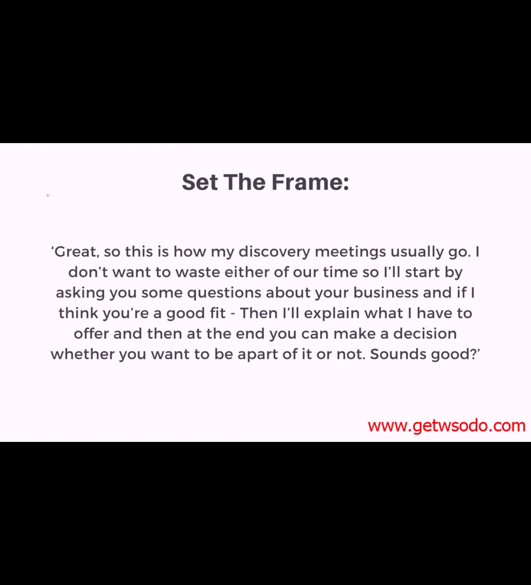
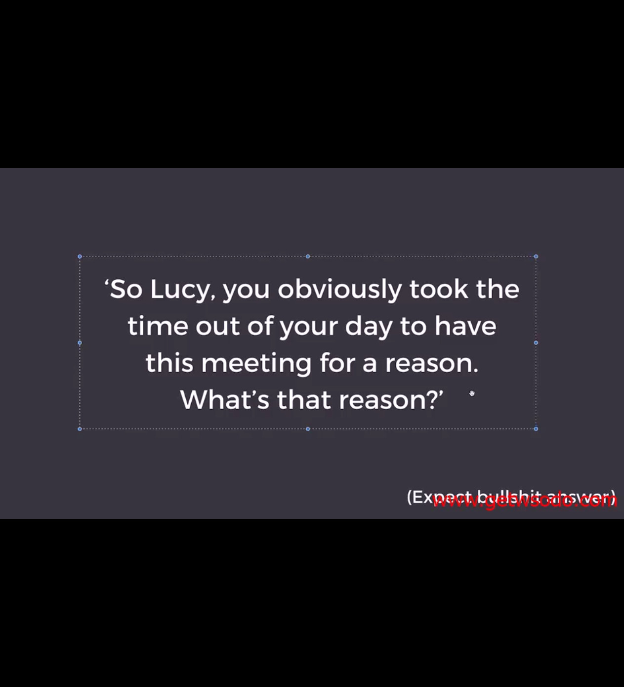
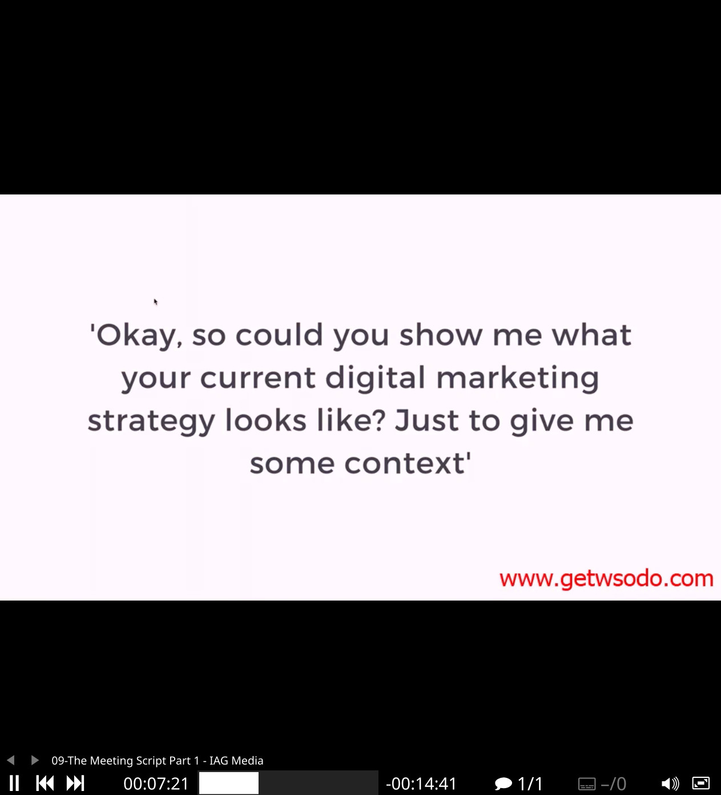
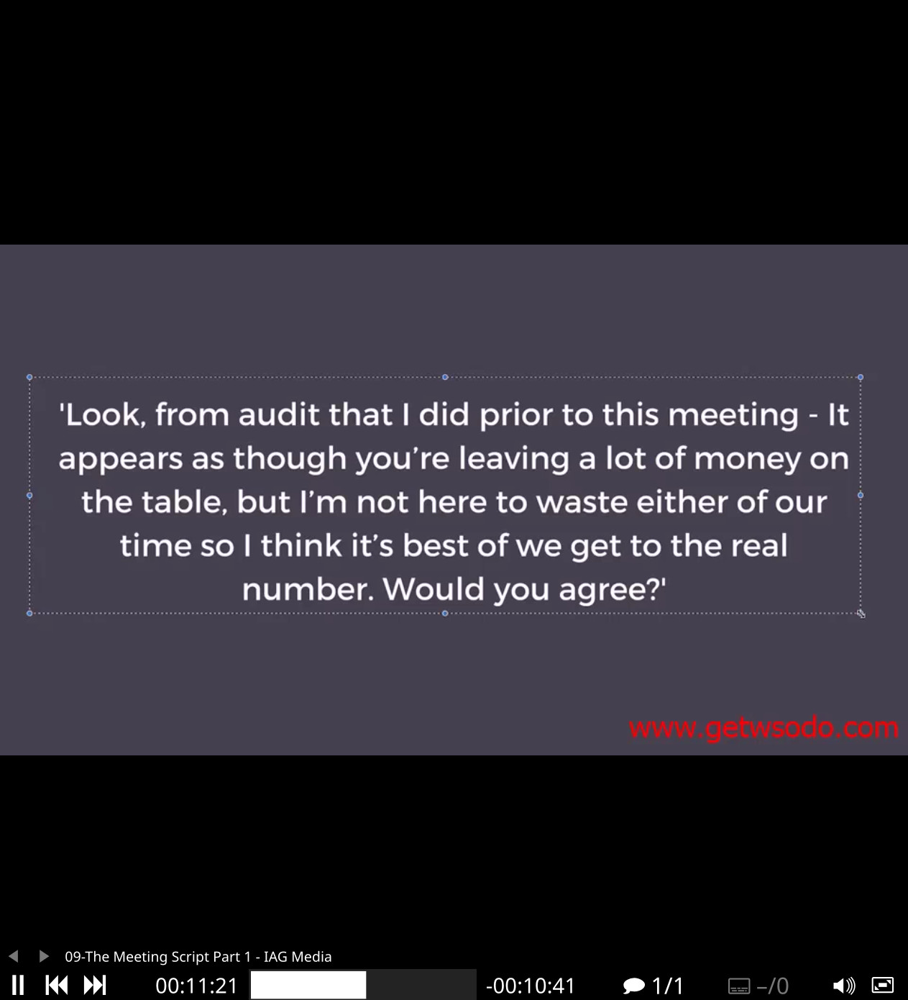
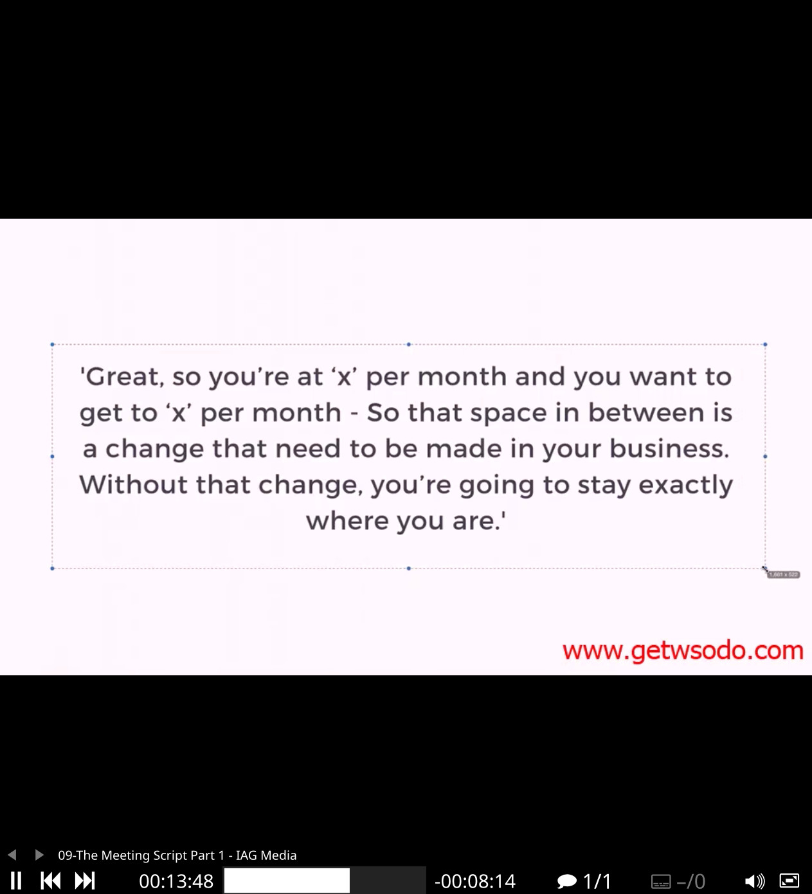
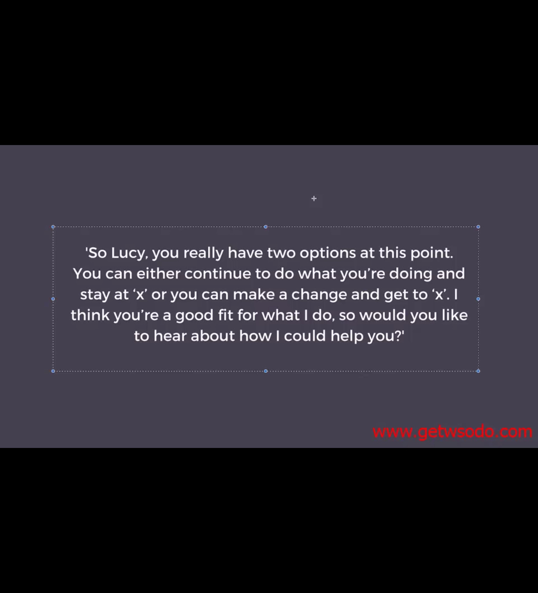

# Script
[[live-coldsession]]
[[inquiry]]
[[objections]]
## Outreach
Sell the call: call it a growth analysis session

### Rapport
Setting the frame is very important. Have a game plan.

imply you had discovery meetings in the past. 
> I don't wanna waste either of time.
if i think you're a good fit.
sounds good?

plant a seed in their head that they're not doing their best. be quiet.
>give me some context

### Questions
[[inquiry]]

### Dissect
The point is to qualify this lead for myself.
>what's the sale process from strangers to you
never interject. time is an investment.
>are you happy with your current customer acquisition system?

How much revenue did your business do last month.

Emotional sales: what's the motivation behind getting to your goal revenue?

How would things be different if you get to that amount of x per month. What's the (personal) effects you'll get if you get to that mark?

People don't have business problems, they have personal problems.

You're qualifying your customers.
Getting them to justify buying helps.

#### Shit sandwich
compliments | critiques | compliment
- critiques help your clients understand what they're missing out on
- stir up their desires to hone their marketing strategies

#### Educate
Provide values by sharing them what they could do. 
Create a dummy ad before hand.
Talk details. Demo traffic ads screenshot.
### Close   
The average lifetime value of a custom.
  
> Do you have any questions?

At this point they are sold on emotions. They need to justify themselves. 

Draw out the gap:

When you say the price, you don't say anything.

### Handle rejections
If you can set up a later day. The battle isn't lost yet. Stoicism bros. Do all you could before letting them decide.

[//begin]: # "Autogenerated link references for markdown compatibility"
[live-coldsession]: live-coldsession.md "Live Cold Session"
[inquiry]: inquiry.md "Inquiry"
[qualification]: qualification.md "qualification"
[//end]: # "Autogenerated link references"